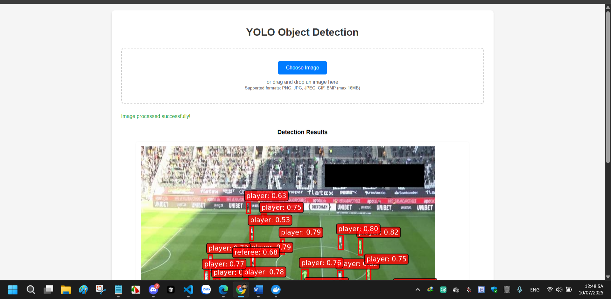

# Model Deployment with Docker

This repository contains the necessary files and instructions to deploy a machine learning model using Docker. The setup ensures a consistent and reproducible environment for model deployment.

## Project Structure
```
yolo-docker-app/
├── app.py
├── requirements.txt
├── Dockerfile
├── docker-compose.yml
├── your_model.pt           # Your YOLO model
├── templates/
│   └── index.html
├── uploads/               # Temporary uploads
└── results/              # Output images
```
- `Dockerfile`: Defines the Docker image configuration.
- `requirements.txt`: Lists Python dependencies for the project.
- `app.py`: Entry point for the application (e.g., API or inference script).
- `best.pt`: My prediction model trained by YOLO.

## Setup Instructions

1. **Clone the Repository**
   ```bash
   git clone https://github.com/khacluat03/deploy-the-model-with-Docker.git
   cd deploy-the-model-with-Docker
   ```

2. **Build the Docker Image**
   ```bash
   docker build -t model-deployment .
   ```

3. **Run the Docker Container**
   ```bash
   docker run -p 8000:8000 model-deployment
   ```
   - The application will be accessible at `http://localhost:8000`.
   - Adjust the port mapping (`8000:8000`) as needed.

## The interface:
<p align="center"></p>
<p align="center"></p>
<p align="center"></p>

## The sample I use:
<p align="center"></p>

## The results:

<p align="center"></p>